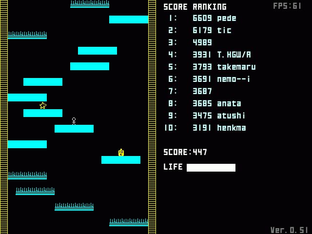

Down!!
======

A game written in [Ruby/SDL](http://ohai.github.io/rubysdl/).

How to run
==========

Windows (binary)
----------------

Execute down.exe (This is compiled version of Down v0.52)

Mac (source)
------------

    $ brew install sdl sdl_ttf sdl_mixer
    $ gem install rubysdl rsdl
    $ rsdl down.rb

Linux (source)
--------------

* Install SDL, SDL_TTF, SDL_Mixer(with mod support)
  - eg. `apt install libsdl1.2debian libsdl1.2-dev libsdl-ttf2.0-0 libsdl-ttf2.0-dev libsdl-mixer1.2 libsdl-mixer1.2-dev`
* `gem install rubysdl`
* `ruby down.rb`

Command-line options
--------------------

* `-h` : Show help
* `-s`, `--silent` : Silent mode (disable sound)
* `-f`, `--fullscreen` : Start in fullscreen
* `--savefile PATH` : Path to savefile  (default: "./save.dat")

License
=======

MIT

History
=======

* 2015-12-31 v1.0.0
  - Added --savefile option
* 2014-05-19 v0.53
  - Support Ruby >= 1.9, etc.
* 2013 Upload to github
* 2003-2004 (v0.52) Remake with Ruby/SDL
* 1997 First version was written in C for NEC 9801Fs

Contact
=======

https://github.com/yhara/down

Yutaka HARA (yhara)
